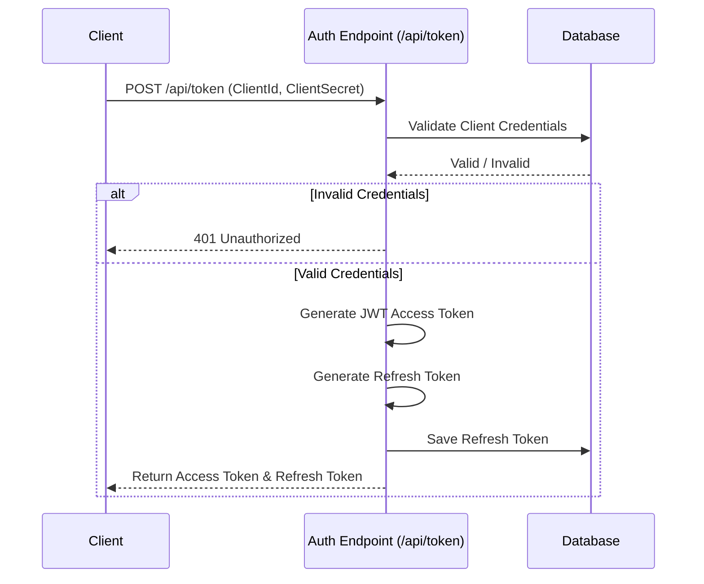
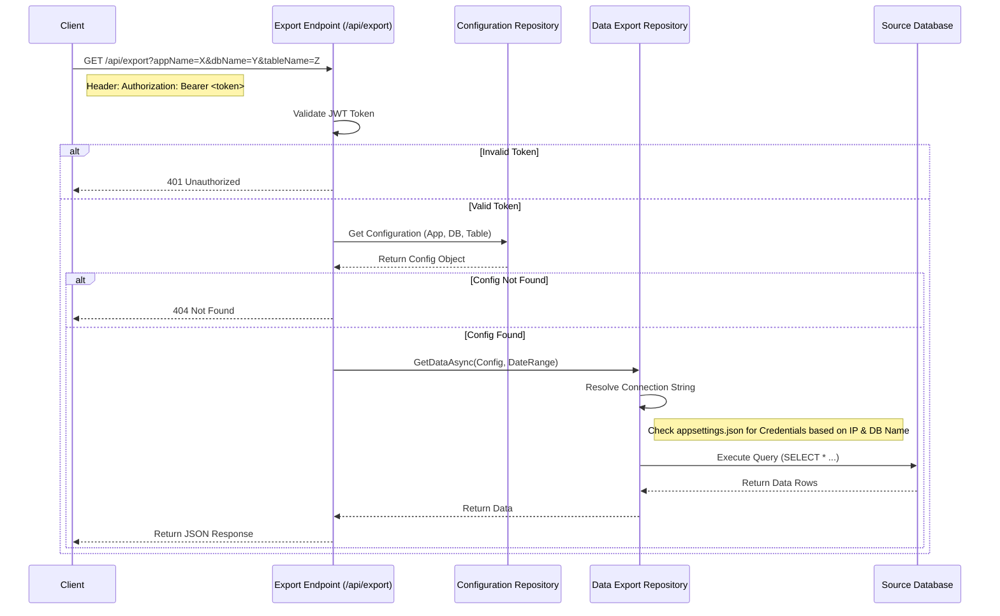

# DataSync Solution

## Overview
DataSync is a .NET 8.0 web application designed to export data from various SQL Server databases based on configurable rules. It features a secure API protected by JWT authentication (Client Credentials flow) and a web interface for managing configurations.

## Setup Instructions

### Prerequisites
*   .NET 8.0 SDK
*   SQL Server

### Database Setup
1.  Create a database named `DataSyncDb`.
2.  Run the seed script located at `DataSync.Data/Seed.sql`. This script will:
    *   Create the necessary tables with the `DataSync_` prefix (`DataSync_ExportConfigurations`, `DataSync_ExportLogs`, `DataSync_ApiClients`, `DataSync_RefreshTokens`).
    *   Insert sample data for configurations and API clients.

### Configuration
1.  Open `DataSync.Web/appsettings.json`.
2.  Update the `ConnectionStrings:DefaultConnection` with your `DataSyncDb` connection string.
3.  Configure `DatabaseCredentials` for your source databases:
    ```json
    "DatabaseCredentials": [
      {
        "ServerIP": "192.168.1.17",
        "DbName": "sales",
        "UserId": "sales_user",
        "Password": "sales_password"
      }
    ]
    ```
    *   **Note:** If no credentials are found for a specific Server/DB combination, the system defaults to Windows Authentication (`Trusted_Connection=True`).

### Running the Application
1.  Navigate to the solution folder.
2.  Run `dotnet build` to ensure all dependencies are restored.
3.  Run `dotnet run --project DataSync.Web`.

---

## Authentication Flow (Client Credentials)

The API uses the OAuth 2.0 Client Credentials flow. Clients (e.g., external scripts, other services) authenticate using a `ClientId` and `ClientSecret` to obtain a JWT access token.

### Flow Chart



### Steps
1.  **Request Token:** The client sends a POST request to `/api/token` with `client_id` and `client_secret`.
2.  **Validation:** The server validates the credentials against the `DataSync_ApiClients` table.
3.  **Token Generation:** If valid, the server generates a signed JWT (Access Token) and a Refresh Token.
4.  **Response:** The client receives the tokens and uses the Access Token in the `Authorization: Bearer <token>` header for subsequent requests.

---

## Data Export Flow

The Data Export feature allows clients to retrieve data from configured tables. The connection to the source database is determined dynamically based on the configuration.

### Flow Chart



### Steps
1.  **Request Data:** The client requests `/api/export` with parameters `appName`, `dbName`, `tableName`, `fromDate`, and `toDate`.
2.  **Authorization:** The API validates the Bearer token.
3.  **Configuration Lookup:** The system looks up the export configuration in `DataSync_ExportConfigurations`.
4.  **Dynamic Connection:**
    *   The `DataExportRepository` checks `appsettings.json` for credentials matching the target `DbServerIP` and `DbName`.
    *   If found, it uses the specific SQL credentials.
    *   If not found, it falls back to Windows Authentication.
5.  **Data Retrieval:** The query is executed against the source database, and the results are returned to the client.
